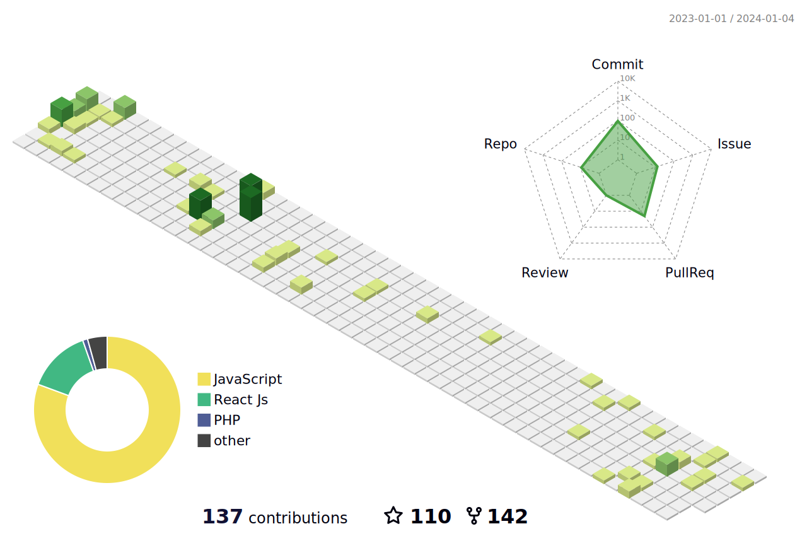

<p>
  
  <p>
    
    
    
    
    
    
    
    
    
    
    <br/>
    
    
    
    
    
    
    
    
    
    
    
    
  </p>
</p>
<p>
  📣 You can Contact me with :<br/>
  <a href="mailto:contact@gillbertmpadon?subject=[GitHub]%20🔥%20Prise%20de%20contact&body=Bonjour%20Stan%2C%0A%0AJe%20viens%20vers%20toi%20aujourd%27hui%20apr%C3%A8s%20avoir%20vu%20ton%20profil%20GitHub%20pour%20..."></a>
  <a href="https://www.facebook.com/profile.php?id=100086767629990"></a>
  <a href="https://instagram.com/ginmpadon"></a>
  <a href="https://linkedin.com/in//gillbert-padon-33597b291"></a>
</p>


<h2>⚡️ Facts About Me ⚡️</h2><br/>
<h3>
  🧔 Aspiring <bold>FullStack and Mobile Developer</bold>. 23 years old, Graduating Student from Palawan State University 🎓.<br/>
  💼 I do a programming tutor and freelance for both students, private individual and clients.<br/>
  💻 I specialized in building applications with Javascript and PHP. However, I am much into React Native and Flask right now.<br/>
  🎥 I am looking for opportunities that could enrich my experience in JavaScript (React JS), PHP, and React Native<br/>
</h3>



<details>
  <summary>Click Here for More ...</summary><br/>

<!--START_SECTION:waka-->

**🐱 My GitHub Data** 
> 💼 Looking to be Hire
 > 
> 📜 24 Public Repositories 
 > 
> 🔑 30 Private Repositories 
 > 

📊 **This Week I Spent My Time On** 

```text
🕑︎ Time Zone: Asia

💬 Programming Languages: 
React Js                                     ████████░░░░░░░░░░░░░░░░░   30.00 % 
Php                                          ███░░░░░░░░░░░░░░░░░░░░░░   25.00 % 
React Native                                 █░░░░░░░░░░░░░░░░░░░░░░░░   20.00 % 
Python                                       ░░░░░░░░░░░░░░░░░░░░░░░░░   10.00 % 
Java, C++ and etc                            ░░░░░░░░░░░░░░░░░░░░░░░░░   15.00 % 

🔥 Editors: 
VS Code                                      ███████████████░░░░░░░░░░   60.00 % 
Chrome                                       ████████░░░░░░░░░░░░░░░░░   30.00 % 
Vin                                          ███░░░░░░░░░░░░░░░░░░░░░░   10.00 % 

💻 Operating System: 
Windows                                      ████████████████████░░░░░   80.00 % 
Ubuntu                                       ░░░░░░░░░░░░░░░░░░░░█████   20.00 % 
```

**I Mostly Code in JavaScript** 

```text
JavaScript               19 repos            █████████░░░░░░░░░░░░░░░░   38.77 % 
HTML                     11 repos            █████░░░░░░░░░░░░░░░░░░░░   22.44 % 
PHP                      8 repos             ███░░░░░░░░░░░░░░░░░░░░░░   23.81 % 
React Native             2 repos             █░░░░░░░░░░░░░░░░░░░░░░░░   21.43 % 
Python                   2 repos             █░░░░░░░░░░░░░░░░░░░░░░░░   21.43 % 
Etc                      7 repos             ███░░░░░░░░░░░░░░░░░░░░░░   21.43 % 
```

 Last Updated on 06/01/2024 00:05:37 UTC
<!--END_SECTION:waka-->
</details>
